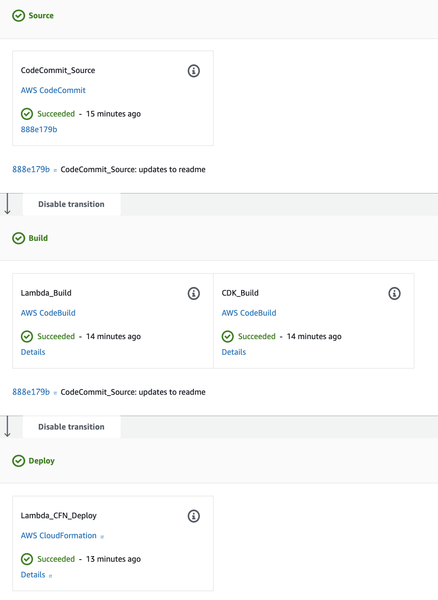
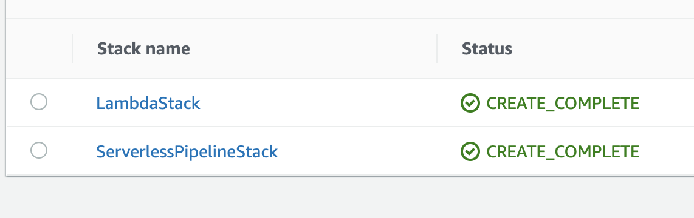

## Description
The AWS Cloud Development Kit (AWS CDK) is an open-source software development framework to define cloud infrastructure in code and provision it through AWS CloudFormation.

The AWS CDK enables you to easily create applications running in the AWS Cloud. But creating the application is just the start of the journey. You also want to make changes to it, test those changes, and finally deploy them to your stack. 

The AWS CDK enables this workflow by using the Code* suite of AWS tools: AWS CodeCommit, AWS CodeBuild, AWS CodeDeploy, and AWS CodePipeline.  

In this example, We will be building and deploying a Microservice(Api GW/Lambda).Your AWS CDK code and your Lambda code are in the same repository. 
The Lambda code is in the `lambda` directory, while your CDK code is in the `bin` and `lib` directories that the cdk init command sets up for your CDK code.

## Requirements
* AWS CLI already configured with Administrator permission
* [NodeJS 8.10+ installed](https://nodejs.org/en/download/)
* [AWS CDK installed](https://docs.aws.amazon.com/cdk/latest/guide/getting_started.html)

## Initial setup & deployment

**Creating the Pipeline infrastructure**
1. Git clone [cdk-serverless-pipeline](https://github.com/srihariph/cdk-serverless-pipeline.git)
2. Create a CodeCommit repo in your AWS Account. 
3. Add a `git remote` and point it at the CodeCommit repo above.
4. `git push` your changes to the codecommit repo
5. Replace `YOUR-CODECOMMIT-REPO-NAME` from lib/cdk-serverless-pipeline-stack.ts with the codecommit repository name created above.
6. Do an `npm install` to install Node Dependencies and Build the typescript code using `npm run build`
7. Deploy the pipeline stack `npm run cdk deploy ServerlessPipelineStack`. After the deployment finishes, you should have a three-stage CodePipeline project in your AWS account.

**Deploying the changes**
Try making a change, such as to your lambda-stack.ts AWS CDK code or to your Lambda function code, and push it to the repository. The pipeline should pick up your change, build it, and deploy it automatically, without any human intervention.

## Useful npm and cdk commands

 * `npm run build`   compile typescript to js
 * `npm run watch`   watch for changes and compile
 * `cdk deploy`      deploy this stack to your default AWS account/region
 * `cdk diff`        compare deployed stack with current state
 * `cdk synth`       emits the synthesized CloudFormation template
